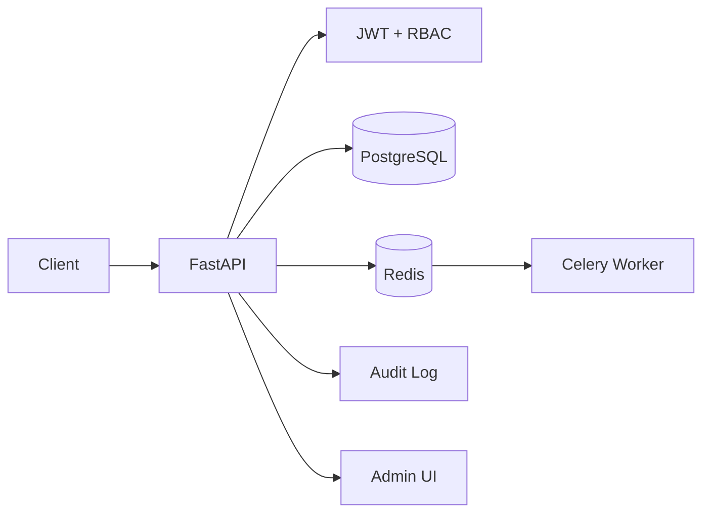

# CampusOS

**Multi-tenant school management platform for academics, classes, students, staff, fees, IDs, attendance, community and administration.**

CampusOS models a real school as a tenant with role-based users and strict school-scoped data. It is designed as a portfolio-grade SaaS backend rather than a basic student CRUD app.

## What it manages

- Schools/tenants and platform super-admin controls
- School admins, accountants, teachers, staff, students and parents
- Academic years
- Physical classrooms
- Grades/classes and sections
- Class teachers
- Subject-to-teacher assignments per class
- Student enrollment into a class for an academic year
- Timetables
- Student and staff attendance
- Student/staff digital ID cards with QR codes
- Fee structures, invoices, discounts, late fees, payments and refunds
- Idempotent payment recording and receipts
- Student fee ledgers and outstanding dues
- Community posts/comments
- Announcements and school events
- In-app notifications + Celery notification dispatch worker
- School dashboard metrics
- Audit logs for administrative actions

## Class management

The relationship requested by the product is represented explicitly:

```text
Student
  ↓ Enrollment (academic year)
Grade 8 - Section A
  ├── Classroom: Main Block / Room 204
  ├── Class Teacher: Anita Sharma
  ├── Science → Anita Sharma
  ├── Mathematics → Raj Mehta
  └── Timetable → subject + teacher + classroom + time
```

The API can therefore answer which class a student belongs to, where that class sits, who the class teacher is, which teachers teach each subject and the complete roster/timetable.

## Fee workflow

```text
Fee Structure
    ↓
Student Invoice
    ├── Tuition
    ├── Transport
    ├── Annual Fee
    ├── Discount
    └── Late Fee
    ↓
Payment (Idempotency-Key)
    ↓
Receipt
    ↓
Optional Refund
```

Example:

```text
Tuition             ₹30,000
Transport             ₹8,000
Annual Fee            ₹5,000
Discount             -₹3,000
Late Fee                ₹500
-----------------------------
Invoice              ₹40,500
Paid                 ₹20,000
Outstanding          ₹20,500
```

## Architecture



See [`docs/ARCHITECTURE.md`](docs/ARCHITECTURE.md) for the domain model and design decisions.

## Main API areas

| Area | Examples |
|---|---|
| Authentication | `/api/v1/auth/login`, `/api/v1/auth/me` |
| Schools/admin | `/api/v1/schools`, `/api/v1/admin/users`, `/api/v1/audit-logs` |
| Students/staff/parents | `/api/v1/people/*` |
| Class management | `/api/v1/academics/sections`, `/roster`, `/students/{id}/class` |
| Subjects/teachers | `/api/v1/academics/sections/{id}/subjects` |
| Timetable | `/api/v1/academics/timetable`, `/sections/{id}/timetable` |
| Fees | `/api/v1/fees/structures`, `/invoices`, `/payments`, `/ledger` |
| Attendance | `/api/v1/attendance` |
| Community | `/api/v1/community/posts`, `/announcements`, `/events` |
| Dashboard | `/api/v1/dashboard` |
| Notifications | `/api/v1/notifications` |

Interactive OpenAPI documentation is available at `/docs`.

## Run locally

```bash
cp .env.example .env
docker compose up --build
```

Open:

- API docs: `http://localhost:8000/docs`
- Admin UI: `http://localhost:8000/admin-ui/`
- Liveness: `http://localhost:8000/health/live`
- Readiness: `http://localhost:8000/health/ready`

## Testing

```bash
pip install -r requirements-dev.txt
ruff check .
alembic upgrade head
pytest -q tests/unit
pytest -q tests/integration
```

The integration workflow creates a school, logs in as its admin, creates an academic year, teacher, student, classroom, class section and subject mapping, enrolls the student, verifies the student's class/teacher/classroom relationship, creates a fee invoice and verifies idempotent partial payment behavior.

## CI

GitHub Actions runs on pushes and pull requests and checks dependencies, Python compilation, Ruff, a fresh PostgreSQL migration, unit tests, integration tests, Docker build and non-root container execution.

## Tech

Python 3.12 · FastAPI · PostgreSQL · SQLAlchemy 2.0 async · Alembic · Redis · Celery · JWT · Docker · Pytest · GitHub Actions
