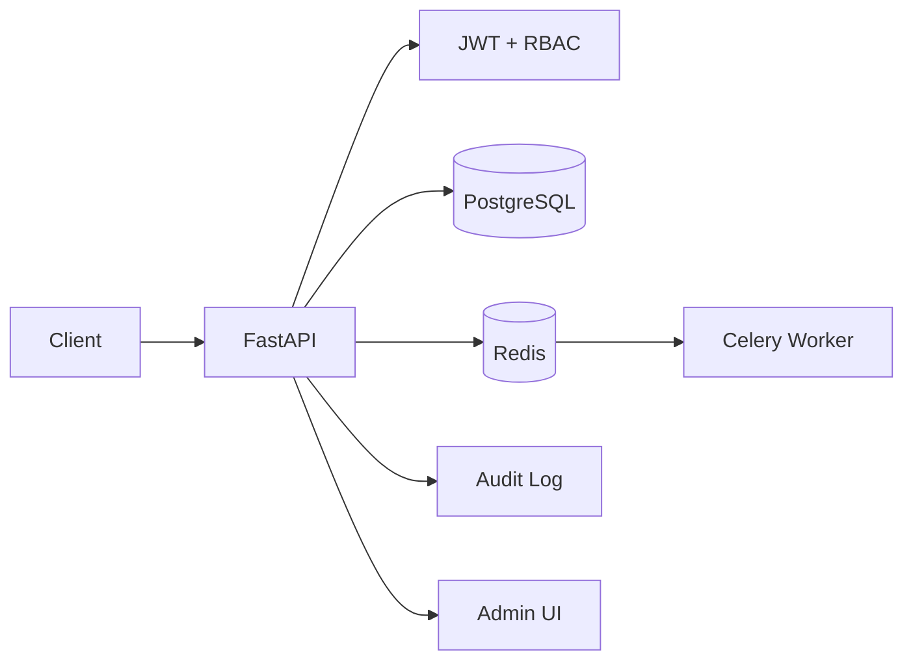

# CampusOS

[](https://github.com/MridulJain0771/CampusOS/actions/workflows/ci.yml)

**Multi-tenant school management platform for academics, classes, students, staff, fees, IDs, attendance, community, reports, payroll and administration.**

CampusOS models a real school as a tenant with role-based users and strict school-scoped data. It is designed as a portfolio-grade SaaS backend rather than a basic student CRUD app.

## What it manages

- Schools/tenants and platform super-admin controls
- School admins, accountants, teachers, staff, students and parents
- Student admission, withdrawal, readmission and lifecycle history
- Staff/teacher joining, termination, rehire and lifecycle history
- Academic years, grades/classes, sections and physical classrooms
- Class teachers and subject-to-teacher assignments
- Student enrollment into a class for an academic year
- Timetables and student/staff attendance
- Student/staff digital ID cards with QR codes
- Fee structures, invoices, discounts, late fees, payments and refunds
- Idempotent payment recording, receipts and student fee ledgers
- Exam definitions, subject scores and published report cards
- Important student/staff/school document records
- Staff salary structures and monthly payroll runs/payments
- Expense categories and school expenditure tracking
- Community posts/comments, announcements and events
- In-app notifications + Celery notification dispatch worker
- School dashboard metrics and audit logs

## Class management

The relationship requested by the product is represented explicitly:

```text
Student
  ↓ Enrollment (academic year)
Grade 8 - Section A
  ├── Classroom: Main Block / Room 204
  ├── Class Teacher: Anita Sharma
  ├── Science → Anita Sharma
  ├── Mathematics → Raj Mehta
  └── Timetable → subject + teacher + classroom + time
```

The API can therefore answer which class a student belongs to, where that class sits, who the class teacher is, which teachers teach each subject and the complete roster/timetable.

## Lifecycle management

Creating a student records an `admitted` lifecycle event and creating staff records a `joined` event. Administrators can later withdraw/readmit students or terminate/rehire teachers and other staff with effective dates, reasons and audit history.

Student withdrawal deactivates active class enrollments and ID cards. Staff termination deactivates the staff profile, linked user access and staff ID cards while preserving history.

## Fee workflow

```text
Fee Structure
    ↓
Student Invoice
    ├── Tuition
    ├── Transport
    ├── Annual Fee
    ├── Discount
    └── Late Fee
    ↓
Payment (Idempotency-Key)
    ↓
Receipt
    ↓
Optional Refund
```

Example:

```text
Tuition             ₹30,000
Transport             ₹8,000
Annual Fee            ₹5,000
Discount             -₹3,000
Late Fee                ₹500
-----------------------------
Invoice              ₹40,500
Paid                 ₹20,000
Outstanding          ₹20,500
```

## Exams, documents and report cards

Exam scores are stored per exam + student + subject with marks, max marks, grade and remarks. Report-card preview calculates totals and percentage; publishing stores a stable report-card snapshot with overall grade and teacher remarks.

Important documents are stored as metadata plus an object-storage reference instead of binary blobs in PostgreSQL. Documents can belong to a student, staff member or the school and include category, issue/expiry dates and an `is_important` flag.

## Payroll and expenditure

Staff salary structures are effective-dated. A monthly payroll run snapshots basic salary, allowances, deductions, gross salary and net salary for each eligible staff member, then tracks payment state, method, reference and paid timestamp.

School expenses are recorded separately by category, vendor, amount, date and payment details. `/api/v1/finance/summary` combines net fee collections, paid payroll and other paid expenditure into an operating view.

## Architecture



Detailed design documentation:

| Document | Purpose |
|---|---|
| [Architecture Overview](docs/ARCHITECTURE.md) | Domain model and key design decisions |
| [High-Level Design (HLD)](docs/HLD.md) | System context, components, tenancy, security and scaling |
| [Low-Level Design (LLD)](docs/LLD.md) | Packages, models, constraints and module-level design |
| [Code Flow](docs/CODE_FLOW.md) | Request-by-request execution flows |
| [Diagram Catalog](docs/DIAGRAMS.md) | System, ER, sequence, lifecycle, finance and CI diagrams |
| [Run Without Docker](docs/LOCAL_DEVELOPMENT.md) | PostgreSQL + Redis + backend + frontend + worker + tests locally |

## Main API areas

| Area | Examples |
|---|---|
| Authentication | `/api/v1/auth/login`, `/api/v1/auth/me` |
| Schools/admin | `/api/v1/schools`, `/api/v1/admin/users`, `/api/v1/audit-logs` |
| Students/staff/parents | `/api/v1/people/*` |
| Lifecycle | `/api/v1/lifecycle/students/{id}/withdraw`, `/staff/{id}/terminate`, `/history` |
| Class management | `/api/v1/academics/sections`, `/roster`, `/students/{id}/class` |
| Subjects/teachers | `/api/v1/academics/sections/{id}/subjects` |
| Timetable | `/api/v1/academics/timetable`, `/sections/{id}/timetable` |
| Fees | `/api/v1/fees/structures`, `/invoices`, `/payments`, `/ledger` |
| Exams/reports | `/api/v1/reports/exams`, `/scores`, `/report-card` |
| Documents | `/api/v1/reports/documents` |
| Payroll | `/api/v1/finance/salary-structures`, `/payroll-runs`, `/payroll-items/{id}/pay` |
| Expenses | `/api/v1/finance/expense-categories`, `/expenses`, `/summary` |
| Attendance | `/api/v1/attendance` |
| Community | `/api/v1/community/posts`, `/announcements`, `/events` |
| Dashboard | `/api/v1/dashboard` |
| Notifications | `/api/v1/notifications` |

Interactive OpenAPI documentation is available at `/docs`.

## Run locally

### Option A — Docker Compose

```bash
cp .env.example .env
docker compose up --build
```

### Option B — without Docker

Run PostgreSQL and Redis locally, then:

```bash
python -m venv .venv
# activate .venv
pip install -r requirements-dev.txt
cp .env.example .env
alembic upgrade head
uvicorn app.main:app --reload --port 8000
```

Start the worker in another terminal:

```bash
celery -A app.workers.celery_app.celery_app worker --loglevel=INFO
```

Serve the frontend separately in another terminal:

```bash
cd frontend
python -m http.server 5173
```

The standalone frontend automatically calls the backend at `http://localhost:8000/api/v1`.

Full Windows/macOS/Linux setup, PostgreSQL/Redis commands, test-database guidance and troubleshooting are in **[Run Without Docker](docs/LOCAL_DEVELOPMENT.md)**.

Open:

- API docs: `http://localhost:8000/docs`
- Separate frontend: `http://localhost:5173`
- Backend-served UI: `http://localhost:8000/admin-ui/`
- Liveness: `http://localhost:8000/health/live`
- Readiness: `http://localhost:8000/health/ready`

## Testing

```bash
pip install -r requirements-dev.txt
ruff check .
alembic upgrade head
pytest -q tests/unit
pytest -q tests/integration
```

The integration suite covers the core school/class/fee flow and the extended lifecycle, important-document, exam/report-card, payroll and expense workflows.

## CI

GitHub Actions runs on pushes and pull requests and validates the application on Python 3.12 and Python 3.14, including dependencies, compilation, Ruff, a fresh PostgreSQL migration, unit tests and integration tests. A separate job validates the Docker image and non-root runtime.

## Tech

Python 3.12 / 3.14 · FastAPI · PostgreSQL · SQLAlchemy 2.0 async · Alembic · Redis · Celery · JWT · Docker · Pytest · GitHub Actions
