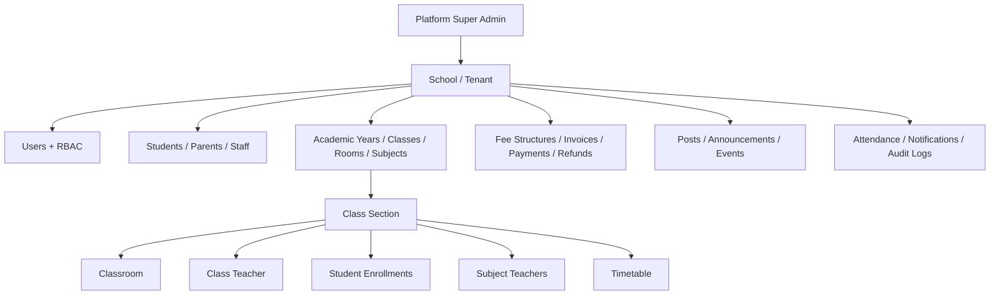
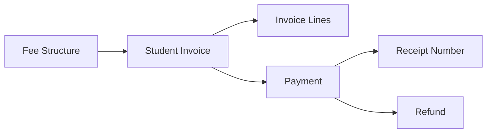

# CampusOS Architecture

CampusOS is designed as a multi-tenant school-management SaaS. Every school-scoped record carries `school_id`, and API queries derive the tenant from the authenticated user instead of accepting an arbitrary tenant from the client.

## Domain model

## Class-management relationship

A student is not attached directly to a grade string. An `Enrollment` joins a student, academic year and class section. The section links to its physical classroom and class teacher. Subject assignments then attach each subject to the teacher responsible for that class. Timetable entries bind section + subject + teacher + room + time.

This supports questions such as:

- Which class is this student in this academic year?
- Which classroom is Grade 8-A using?
- Who is the class teacher?
- Who teaches Science to Grade 8-A?
- Which students belong to the section?
- Where and when is the next Science period?

## Roles

- `super_admin`: manages schools/tenants.
- `school_admin`: manages one school.
- `accountant`: fee operations and finance views.
- `teacher`: academic/community/attendance access.
- `staff`: school operations.
- `student`: student-facing access.
- `parent`: guardian-facing access.

Role checks happen at the route boundary. Tenant checks are applied in school-scoped queries.

## Fee ledger

Payments use an `Idempotency-Key` unique inside the school so network retries do not create duplicate financial records. Invoice payment state moves through `open -> partial -> paid`. Refunds reduce the paid amount and reopen the invoice state when necessary.

## Reliability and operations

- PostgreSQL is the source of truth.
- Redis is used by Celery and readiness checks.
- Celery provides background notification delivery/retry semantics.
- Alembic owns schema evolution.
- Audit logs capture sensitive admin actions.
- Liveness and dependency-aware readiness endpoints support deployments.
- Docker runs the API as a non-root user.
- GitHub Actions validates dependencies, Python compilation, Ruff, migrations, unit tests, integration tests and Docker build.

## Production extensions

A larger deployment could add S3-backed document/photo storage, payment-gateway webhooks, SMS/email providers, row-level security, per-tenant database strategies, observability with OpenTelemetry, admissions workflow, examination/report cards, transport/hostel modules and payroll.
