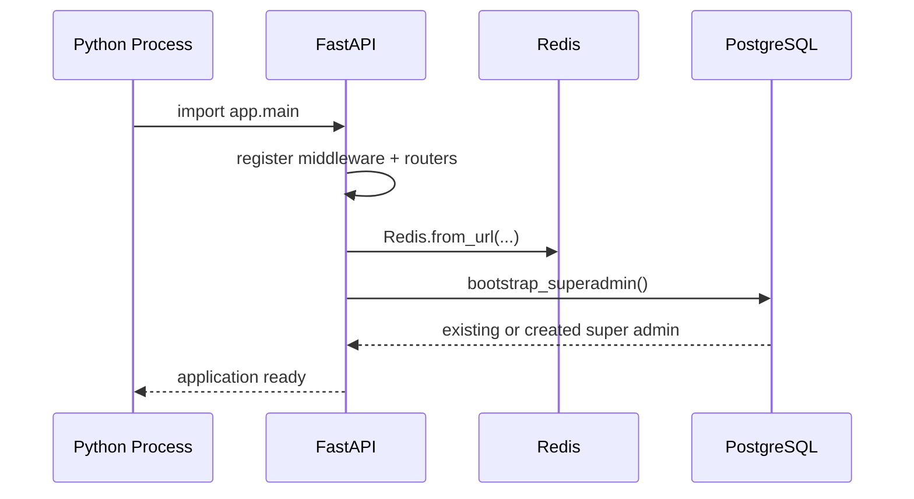
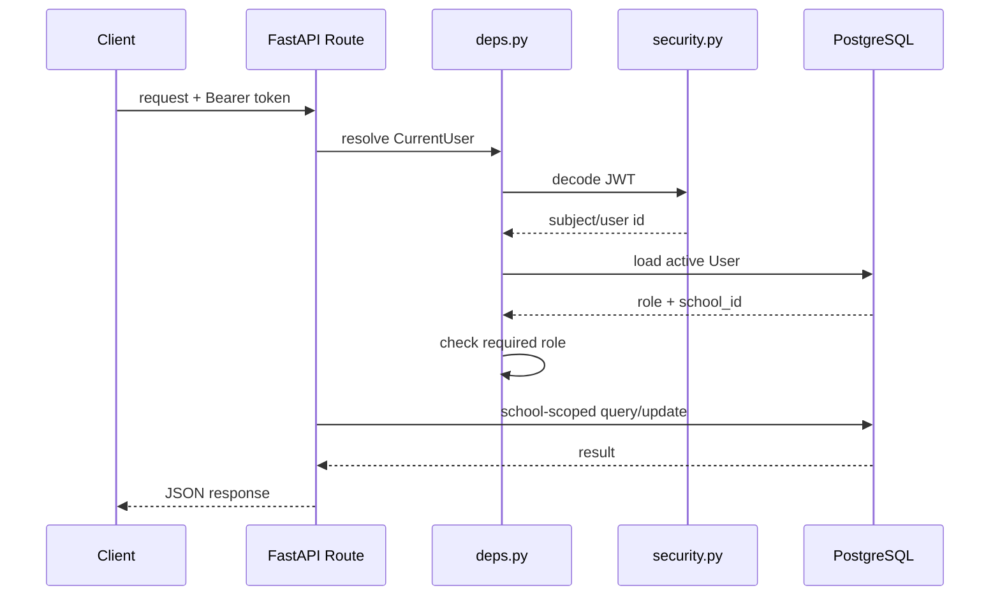
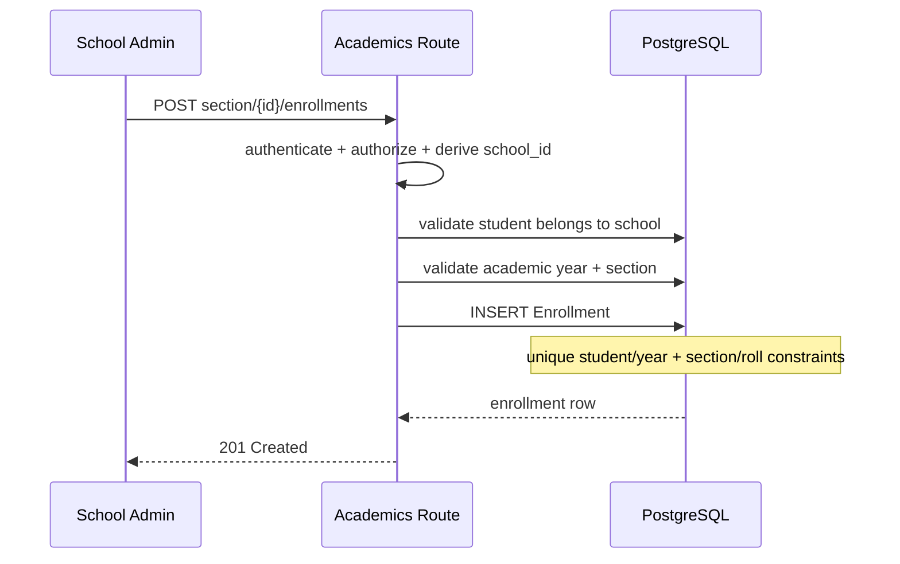
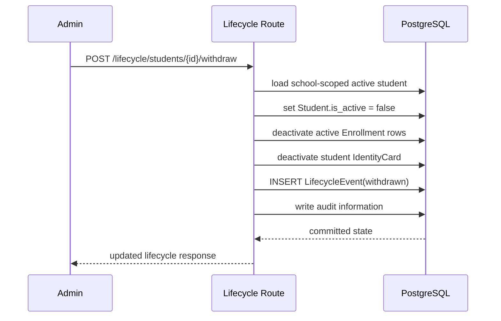
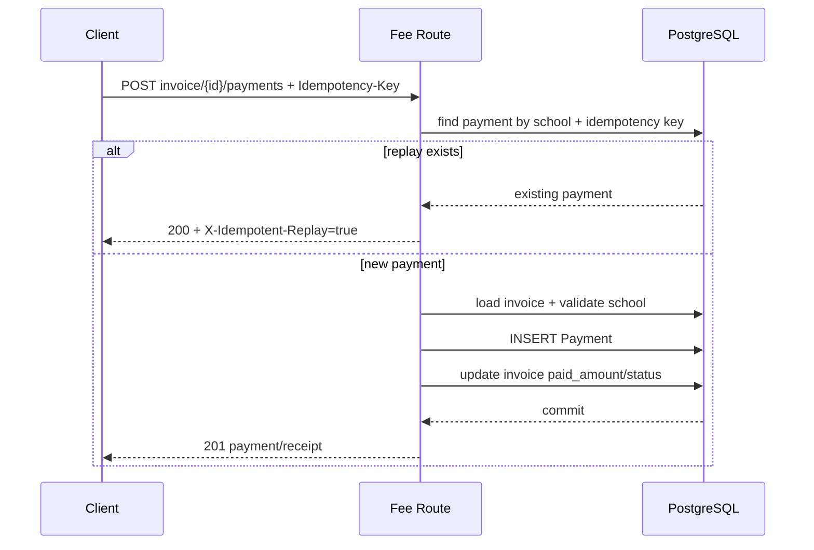
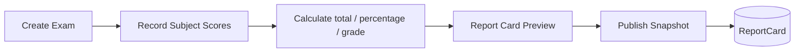
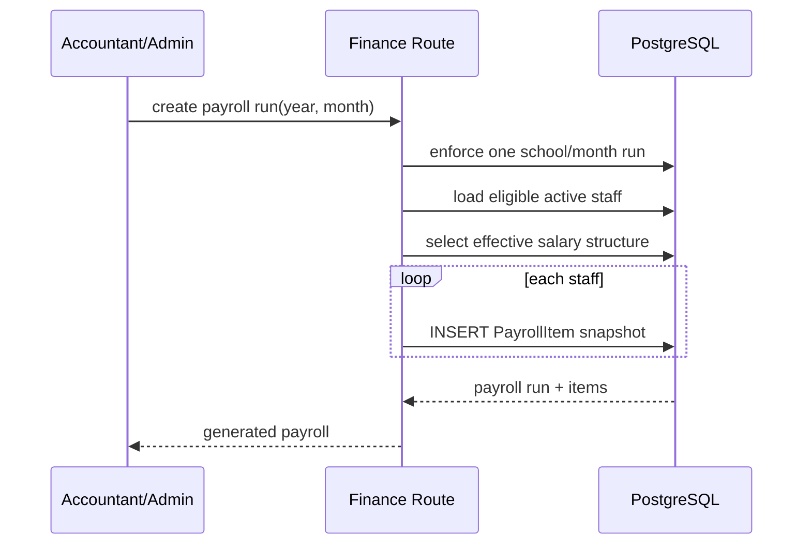
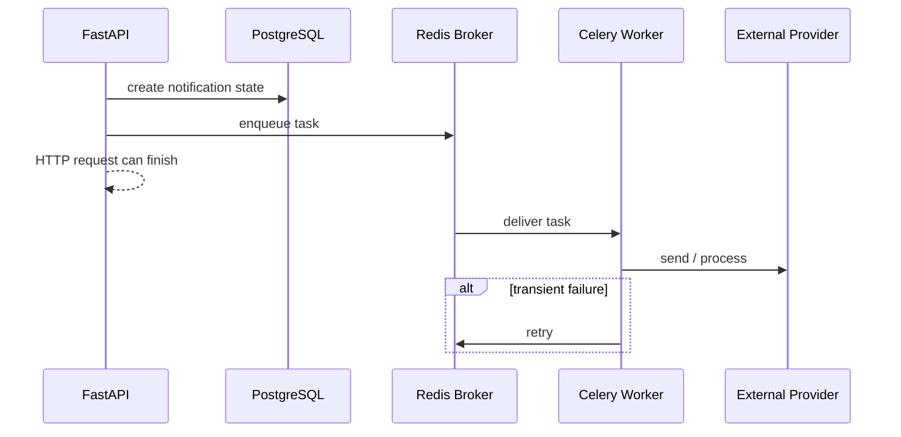
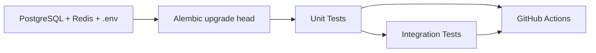

# CampusOS Code Flow

This document follows actual request paths from the browser/API client through FastAPI dependencies, domain code and storage.

## 1. Application startup



On shutdown the Redis client and SQLAlchemy engine are closed/disposed.

## 2. Generic authenticated request



## 3. Login flow

```text
POST /api/v1/auth/login
  -> validate request body
  -> load User by email
  -> verify password hash
  -> reject inactive/invalid user
  -> create JWT with user id
  -> return access_token
```

Protected requests later load the user again, so a disabled user loses access even if an old token has not yet expired.

## 4. Student enrollment flow



Resolving the student's class follows:

```text
Student
  -> active Enrollment
  -> ClassSection
  -> Classroom
  -> class_teacher_staff_id
  -> ClassSubjectTeacher rows
  -> Subject + teacher mappings
```

## 5. Student withdrawal flow



Readmission records a new lifecycle event and restores the current active state; historical events remain unchanged.

## 6. Staff termination flow

```text
POST /api/v1/lifecycle/staff/{id}/terminate
  -> authorize school admin
  -> locate staff inside caller's school
  -> set Staff.is_active = false
  -> disable linked user access when present
  -> deactivate staff identity card
  -> append LifecycleEvent(terminated)
  -> preserve payroll/attendance/history rows
```

## 7. Fee payment flow



The database unique constraint on `(school_id, idempotency_key)` is the final duplicate-payment guard.

## 8. Exam score and report-card flow



A score is unique for exam + student + subject.

Publishing writes a separate `ReportCard` snapshot so later source-record edits do not silently redefine a historical published report.

## 9. Document flow

```text
Client / Admin
  -> create document metadata
  -> validate owner belongs to current school
  -> store category/title/storage URL/dates/important flag
  -> PostgreSQL DocumentRecord

Actual file bytes
  -> external object storage
  -> referenced by storage_url
```

## 10. Payroll generation flow



Payment flow:

```text
PayrollItem pending
  -> record payment method/reference/time
  -> status paid
  -> finance summary includes paid payroll
```

## 11. Expense flow

```text
Accountant/Admin
  -> choose ExpenseCategory
  -> POST expense
  -> tenant validation
  -> store amount/vendor/date/method/reference/status
  -> finance summary aggregates paid expenditure
```

## 12. Notification background flow



## 13. Local frontend flow

When opened through FastAPI:

```text
Browser :8000/admin-ui/
  -> static frontend
  -> same-origin /api/v1
```

When opened separately:

```text
Browser :5173
  -> static frontend
  -> http://localhost:8000/api/v1
  -> FastAPI CORS permits localhost:5173
```

## 14. Test flow



Integration tests create real tenant/domain rows and exercise authentication, class assignment, fee payment, lifecycle, reports, payroll and expenses against PostgreSQL/Redis-backed application startup.
