# CampusOS Diagram Catalog

This page collects the main architectural and business diagrams in one place for design reviews and interviews.

## 1. System context

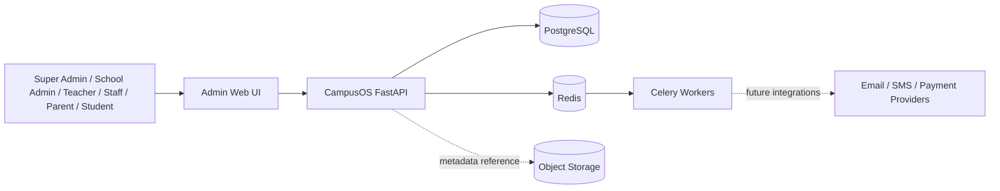

## 2. Backend module map

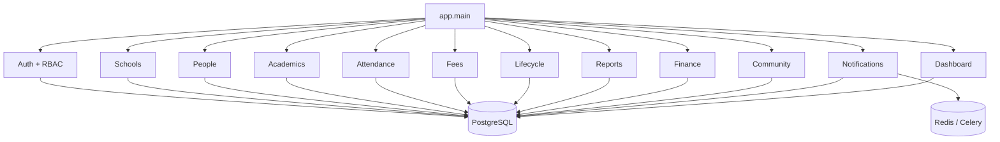

## 3. Tenant boundary

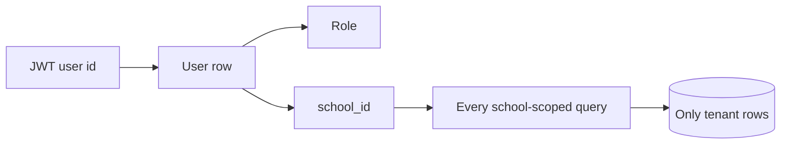

## 4. Academic class relationship

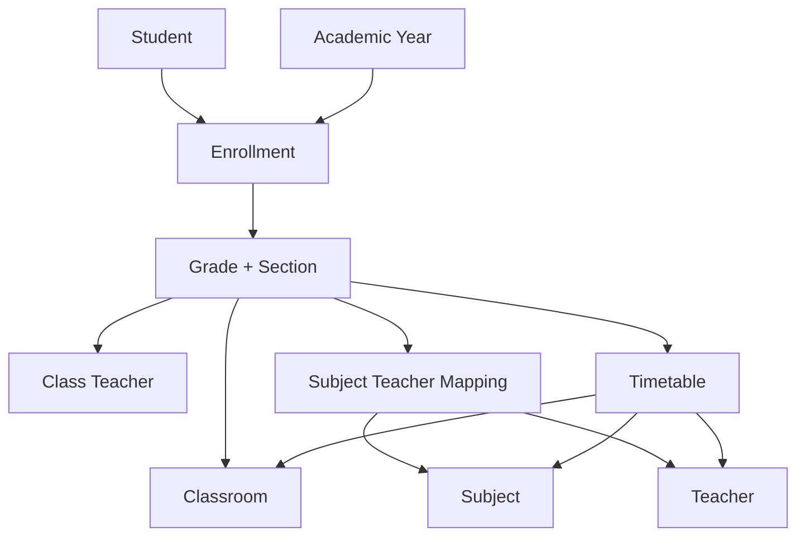

## 5. Core entity relationship view

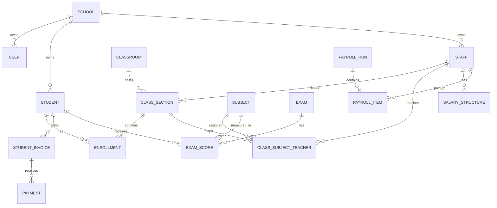

## 6. Lifecycle state flow

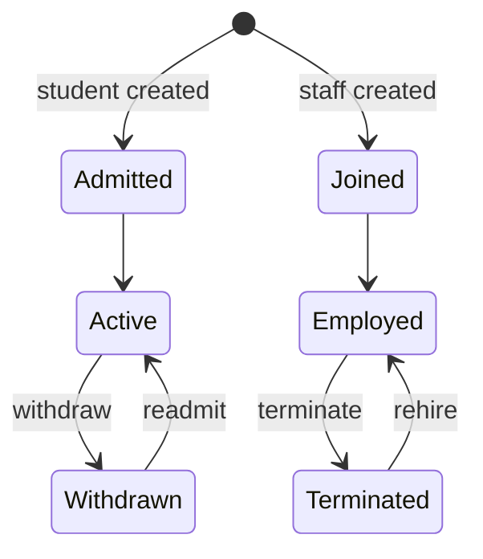

History is append-only in `LifecycleEvent`; `is_active` represents current state.

## 7. Fee lifecycle

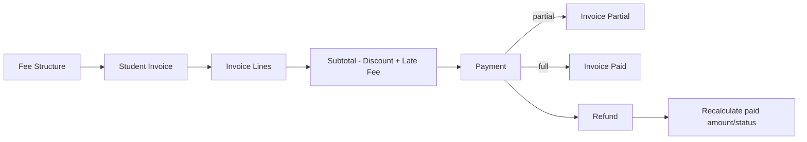

## 8. Idempotent payment sequence

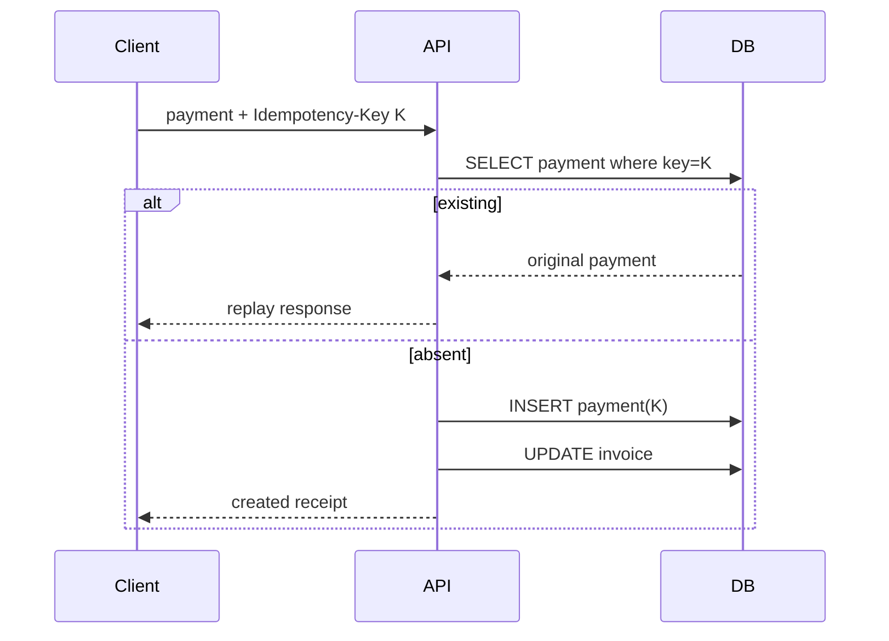

## 9. Exam/report flow

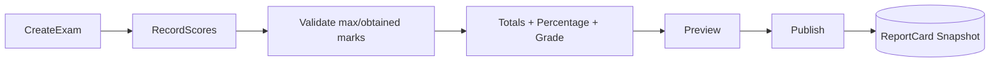

## 10. Payroll and expenditure

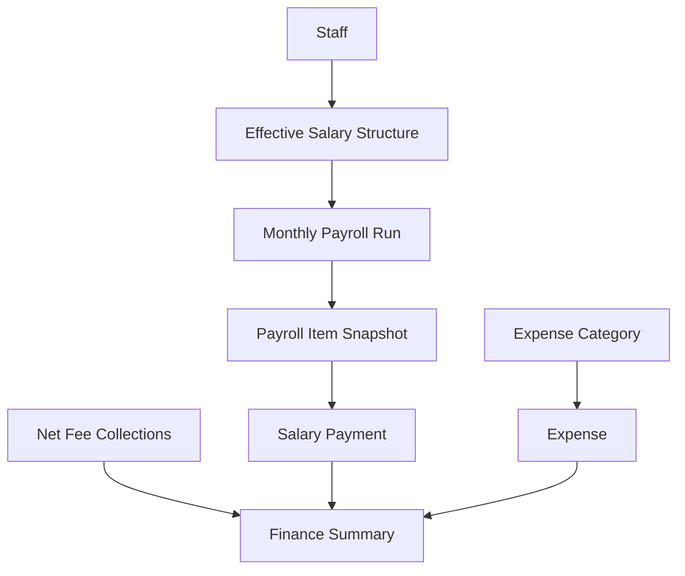

## 11. Notification flow

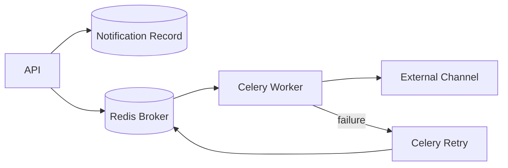

## 12. Local development topology

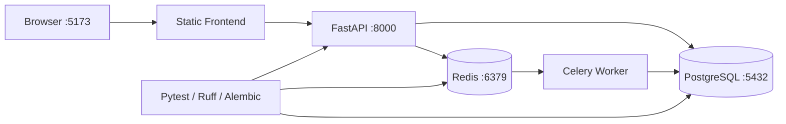

## 13. CI flow

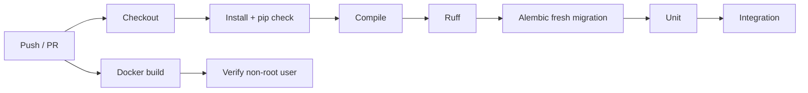
