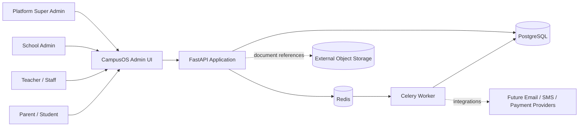
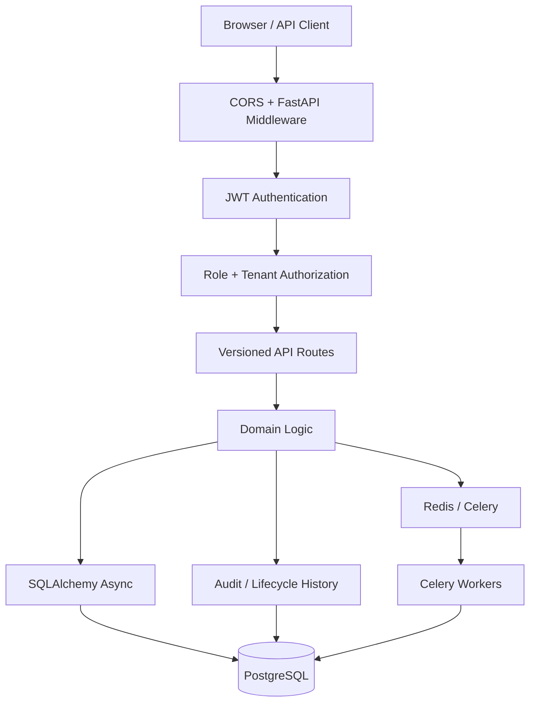
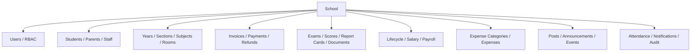

# CampusOS High-Level Design (HLD)

## 1. Purpose

CampusOS is a multi-tenant school-management SaaS backend. A single deployment can serve multiple schools while keeping school-owned data isolated through `school_id` and authenticated user context.

Primary domains:

- identity, authentication and RBAC;
- student, parent, teacher and staff management;
- academic years, classes, sections, rooms, subjects and timetables;
- enrollment and attendance;
- fees, payments and refunds;
- exams, scores, report cards and document metadata;
- staff lifecycle, payroll and school expenditure;
- community, notifications and audit history.

## 2. System context



CampusOS currently stores document metadata and a `storage_url`; the object bytes are expected to live outside PostgreSQL.

## 3. Logical architecture



## 4. Major components

### FastAPI API

The API is stateless apart from external PostgreSQL/Redis dependencies. Routers are grouped by domain under `app/api/routes`.

### PostgreSQL

PostgreSQL is the source of truth for tenant data, users, academics, financial records, report cards, lifecycle history, notifications and audit logs.

### Redis

Redis supports readiness checks and Celery broker/result traffic. The configured databases separate application/readiness traffic from queue traffic.

### Celery

Celery is used for work that should not block the HTTP request path, currently notification dispatch and retry-oriented background processing.

### Admin frontend

The current frontend is a lightweight static admin UI. It can be mounted by FastAPI at `/admin-ui/` or served independently on port 5173 during development.

## 5. Multi-tenancy

School-scoped entities carry `school_id`.

The tenant is derived from the authenticated user rather than trusted from arbitrary request payloads:

```text
Bearer token
  -> user id
  -> active User row
  -> User.school_id
  -> school-scoped query
```

The platform `super_admin` is the exception: it can create/manage schools and is not required to belong to one school.

## 6. Authorization model

Roles:

```text
super_admin
school_admin
accountant
teacher
staff
student
parent
```

Authorization is enforced at route boundaries through dependency functions such as `get_current_user`, `require_roles(...)` and `school_id_for(user)`.

Authentication answers "who is the caller?". RBAC answers "may this role perform this operation?". Tenant filtering answers "which school's rows may this caller touch?".

## 7. Core domain boundaries



## 8. Data ownership and consistency

Financial and academic records use PostgreSQL transactions as the durable source of truth.

Examples of strong invariants enforced by database constraints:

- one enrollment per student per academic year;
- one roll number per class section;
- one subject assignment per section + subject;
- one exam score per exam + student + subject;
- one report card per exam + student;
- one payroll run per school + year + month;
- one payroll item per payroll run + staff;
- one payment idempotency key per school.

Published report cards and payroll items are snapshots so historical results are not silently rewritten when source configuration changes later.

## 9. Key synchronous and asynchronous paths

Synchronous path:

```text
Client -> FastAPI -> JWT/RBAC -> domain operation -> PostgreSQL -> response
```

Asynchronous path:

```text
Client -> FastAPI -> PostgreSQL/Redis enqueue -> response
                                  |
                                  v
                              Celery worker
                                  |
                                  v
                           external work / DB
```

## 10. Reliability

- `/health/live` proves the API process is alive.
- `/health/ready` checks critical dependencies.
- Alembic controls database schema evolution.
- CI runs lint, compilation, migrations, unit tests, integration tests and Docker validation.
- Financial payment retries are protected with an idempotency key.
- Lifecycle history is append-oriented rather than relying only on mutable active flags.
- Docker runtime uses a non-root application user.

## 11. Scaling model

The FastAPI layer can be horizontally scaled because durable state lives outside the process.

Typical scale-out path:

```text
Load Balancer
   -> API instance 1
   -> API instance 2
   -> API instance N

All API instances
   -> PostgreSQL
   -> Redis

Celery queue
   -> worker 1
   -> worker 2
   -> worker N
```

PostgreSQL remains the main consistency boundary. At larger scale, connection pooling, read replicas, partitioning/archive strategy and tenant-aware indexes become important.

## 12. Security boundaries

- passwords are hashed before storage;
- JWTs identify users;
- inactive users cannot authenticate through protected endpoints;
- role checks gate privileged operations;
- school queries are tenant-scoped;
- document bytes are not stored directly in database rows;
- audit/lifecycle tables preserve administrative history.

For production, secrets should come from a managed secret store rather than committed environment files.

## 13. Deployment views

Supported development views:

```text
A. Docker Compose
   API + PostgreSQL + Redis + worker

B. Native local development
   PostgreSQL local
   Redis local
   FastAPI :8000
   Celery worker
   Static frontend :5173
```

A production deployment can independently scale the stateless API and worker tiers while using managed PostgreSQL, Redis and object storage.
