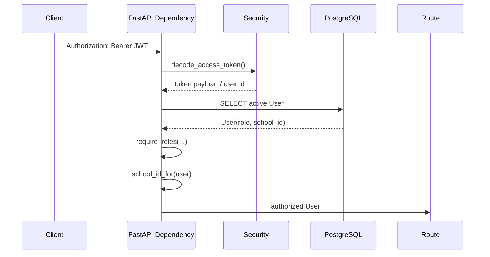
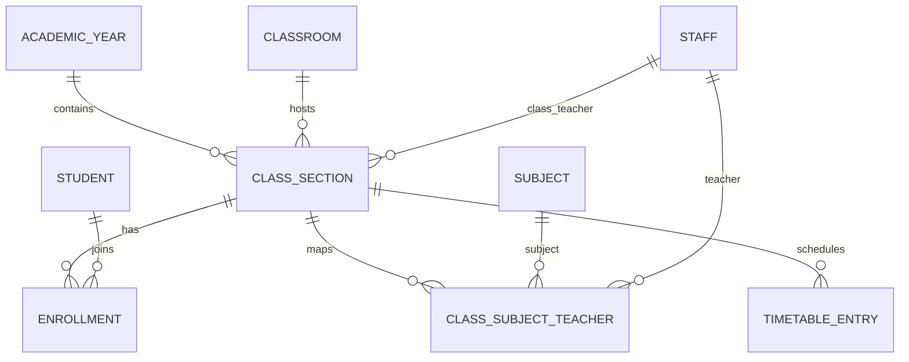
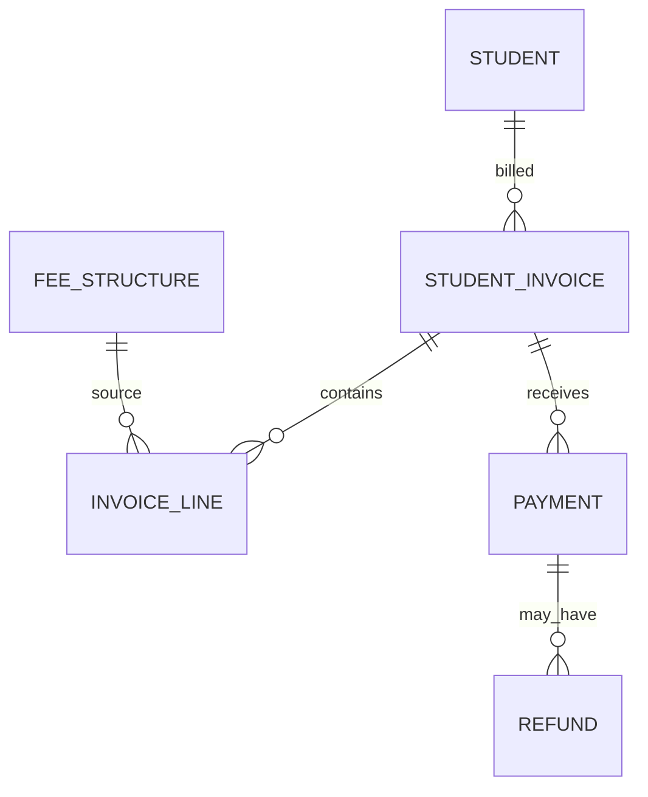
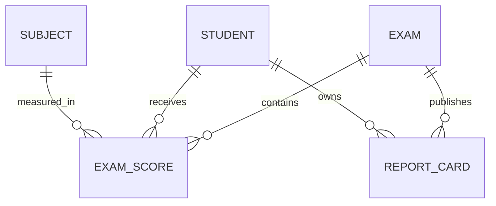
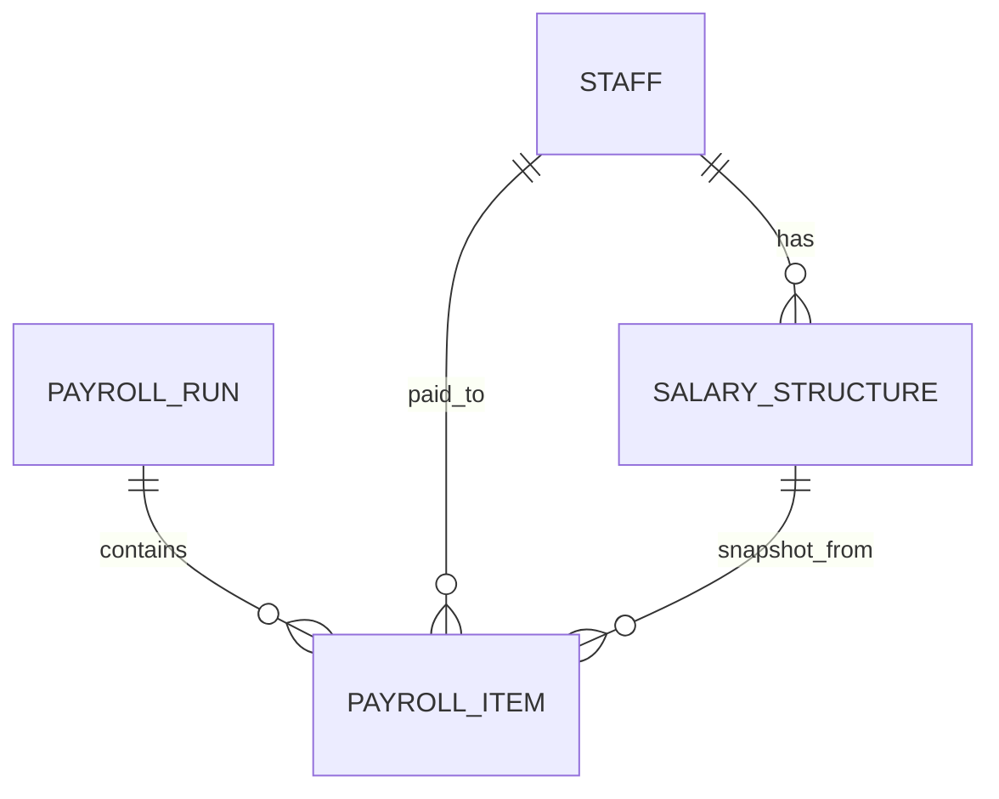

# CampusOS Low-Level Design (LLD)

## 1. Code organization

```text
app/
  api/
    deps.py
    routes/
      auth.py
      schools.py
      people.py
      academics.py
      attendance.py
      fees.py
      finance.py
      lifecycle.py
      reports.py
      community.py
      dashboard.py
      notifications.py
      health.py
  core/
    config.py
    security.py
  db/
    base.py
    session.py
  models/
    core.py
    people.py
    academics.py
    fees.py
    operations.py
    community.py
    enums.py
  schemas/
  services/
  workers/
    celery_app.py
  main.py

migrations/
frontend/
tests/
docs/
```

`app.main` owns application startup, Redis lifecycle, router registration and static frontend mounting.

## 2. Request dependencies

`app/api/deps.py` is the common authorization boundary.



## 3. Database session

`app.db.session` creates one asynchronous SQLAlchemy engine and `AsyncSession` factory.

```text
FastAPI request
  -> Depends(get_db)
  -> AsyncSession
  -> SQLAlchemy async query
  -> asyncpg
  -> PostgreSQL
```

The application disposes the engine during FastAPI lifespan shutdown.

## 4. Identity and tenant model

### School

Key fields:

```text
id
name
code (unique)
timezone
currency
is_active
```

### User

```text
id
school_id -> School (nullable for platform super admin)
email (globally unique)
password_hash
role
is_active
```

Every school-level workflow obtains the tenant through `User.school_id`.

## 5. People model

### Student

Uniqueness:

```text
(school_id, admission_no)
```

Current state is represented by `is_active`; historical admission/withdrawal/readmission events live in `LifecycleEvent`.

### Staff

Uniqueness:

```text
(school_id, employee_no)
```

`is_teacher` allows teacher-specific academic assignment while using the same staff identity model.

### Parent / StudentParent

`StudentParent` is the many-to-many guardian mapping with relation and primary-guardian metadata.

### IdentityCard

One active conceptual card record is constrained per:

```text
(school_id, holder_type, holder_id)
```

## 6. Academic model



Important invariants:

```text
Enrollment:
  UNIQUE(student_id, academic_year_id)
  UNIQUE(class_section_id, roll_no)

ClassSubjectTeacher:
  UNIQUE(class_section_id, subject_id)

ClassSection:
  UNIQUE(school_id, academic_year_id, grade_name, section_name)
```

This structure lets the API resolve a student's academic year, class/section, classroom, class teacher, subject teachers and timetable without embedding those values in the student row.

## 7. Attendance

One `Attendance` table supports student or staff attendance.

Uniqueness prevents duplicate daily marks:

```text
(school_id, attendance_date, student_id)
(school_id, attendance_date, staff_id)
```

## 8. Fee domain



`StudentInvoice` stores subtotal, discount, late fee, total and paid amount.

Payment guarantees include:

```text
UNIQUE(school_id, receipt_no)
UNIQUE(school_id, idempotency_key)
```

A retry using the same idempotency key returns/reuses the original logical payment rather than creating a second payment.

## 9. Lifecycle domain

`LifecycleEvent` is an append-style history record:

```text
school_id
entity_type = student | staff
entity_id
event_type = admitted | withdrawn | readmitted | joined | terminated | rehired
effective_on
reason
notes
actor_user_id
```

Current-state flags remain on Student/Staff for fast filtering.

Withdrawal side effects include deactivating active enrollments and student ID cards. Staff termination deactivates the staff record, linked access and staff identity card while preserving historical rows.

## 10. Exams and report cards



Score uniqueness:

```text
UNIQUE(exam_id, student_id, subject_id)
```

Published report-card uniqueness:

```text
UNIQUE(exam_id, student_id)
```

A report card stores total marks, maximum marks, percentage, overall grade and teacher remarks as a publication snapshot.

## 11. Document records

`DocumentRecord` stores metadata:

```text
owner_type
owner_id
category
title
storage_url
mime_type
issued_on
expires_on
is_important
metadata_json
uploaded_by_user_id
```

The database stores references, not large binary files.

## 12. Payroll



`SalaryStructure` is effective-dated.

One monthly payroll run is allowed for each school:

```text
UNIQUE(school_id, year, month)
```

One payroll item per staff member in a run:

```text
UNIQUE(payroll_run_id, staff_id)
```

Payroll items snapshot basic salary, allowances, deductions, gross and net salary so historical payroll remains stable if a salary structure changes later.

## 13. Expenditure

`ExpenseCategory` is unique by school/name.

`Expense` records:

```text
category
amount
incurred_on
vendor
description
payment_method
reference
status
recorded_by_user_id
```

Finance summary combines fee collections, paid payroll and general expenditure for an operating view.

## 14. Notifications and background processing

Redis is configured as the Celery broker/result backend.

```text
API operation
  -> create notification / enqueue work
  -> Redis broker
  -> Celery worker
  -> execute side effect / retry
```

Celery configuration enables late acknowledgements, task-start tracking and a prefetch multiplier of 1.

## 15. Auditability

Sensitive administrative workflows write either `AuditLog`, `LifecycleEvent`, or durable financial/reporting records.

The design separates:

```text
current state      -> Student.is_active / Staff.is_active / status fields
business history   -> lifecycle / payments / payroll / report cards
technical history  -> audit logs
```

## 16. Schema evolution

Alembic migrations are the only supported schema-evolution mechanism.

Local and CI startup sequence:

```text
configuration
  -> database reachable
  -> alembic upgrade head
  -> application/tests
```
